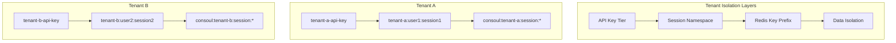
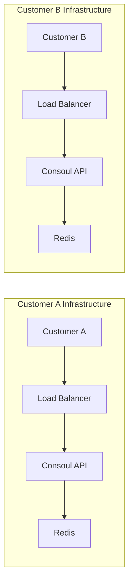
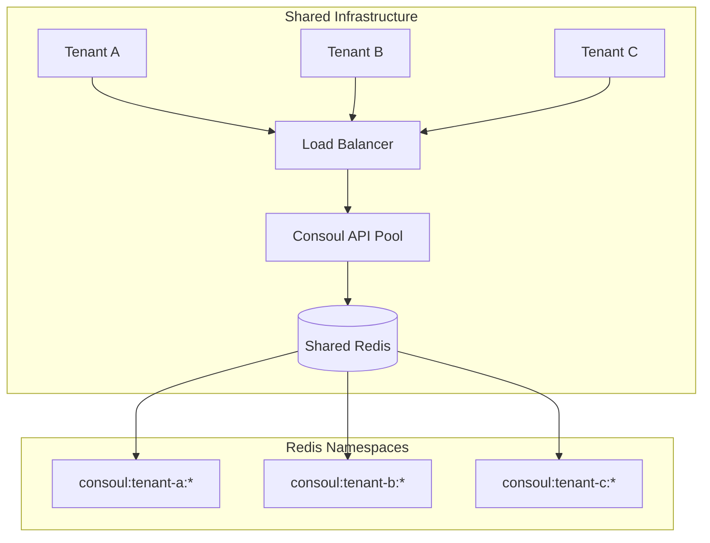
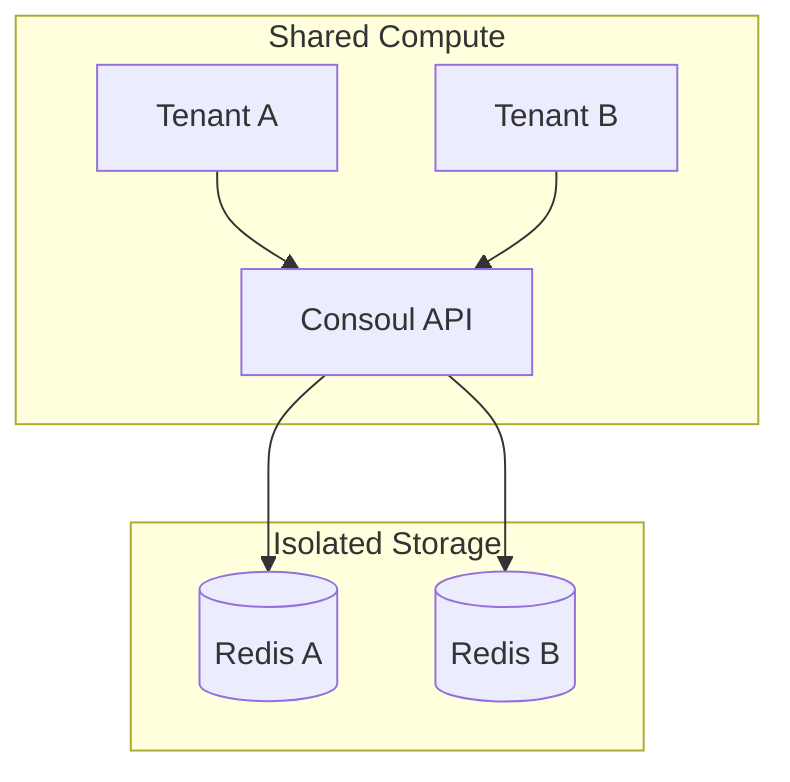
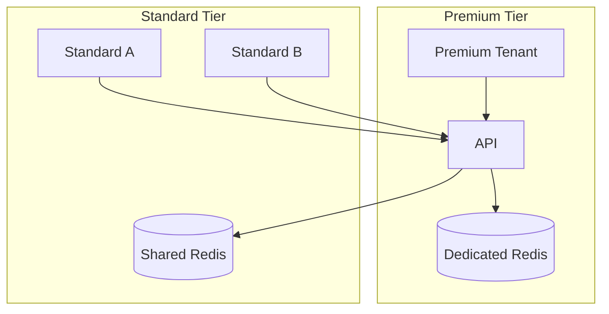

# Multi-Tenancy Isolation Patterns

Deploy Consoul securely for multiple tenants with proper data isolation, per-tenant rate limiting, and session boundaries.

## Quick Reference

| Pattern | Isolation Level | Complexity | Use Case |
|---------|-----------------|------------|----------|
| [Single-Tenant](#pattern-a-single-tenant) | Complete | Low | Dedicated deployments |
| [Shared Redis](#pattern-b-multi-tenant-shared-redis) | Namespace | Medium | SaaS platforms |
| [Isolated Redis](#pattern-c-tenant-isolated-redis) | Instance | High | Regulated industries |
| [Hybrid](#pattern-d-hybrid) | Mixed | High | Premium tier differentiation |

## Architecture Overview

Consoul provides multi-tenancy through **namespace-based isolation** at three levels:



**Key Components:**

1. **API Key Tiers**: Map API keys to rate limit tiers using glob patterns
2. **Session Namespaces**: Scope sessions with `{tenant}:{user}:{session}` format
3. **Redis Key Prefixes**: Isolate stored data with configurable key prefixes
4. **Rate Limiting**: Apply per-tenant quotas via tiered rate limiting

---

## Tenant Isolation Strategies

### Session Namespace Convention

Consoul uses a hierarchical namespace pattern for session IDs:

```
{tenant}:{user}:{session}
```

**Components:**

| Component | Description | Example |
|-----------|-------------|---------|
| `tenant` | Organization/customer identifier | `acme_corp` |
| `user` | User within the tenant | `alice` |
| `session` | Unique conversation identifier | `a1b2c3d4e5f6` |

### Building Namespaced Session IDs

Use the `SessionIdBuilder` for constructing isolated session IDs:

```python
from consoul.sdk.session_id import SessionIdBuilder

# Multi-tenant session with auto-generated ID
session_id = (
    SessionIdBuilder()
    .tenant("acme_corp")
    .user("alice")
    .session()  # Auto-generates secure UUID
    .build()
)
# Result: "acme_corp:alice:a1b2c3d4e5f6"

# User-scoped session (single-tenant)
session_id = (
    SessionIdBuilder()
    .user("alice")
    .session("my_chat")
    .build()
)
# Result: "alice:my_chat"
```

Or use the convenience function:

```python
from consoul.sdk.session_id import build_session_id

# Quick multi-tenant session
session_id = build_session_id(
    session_id="chat_001",
    user_id="alice",
    tenant_id="acme"
)
# Result: "acme:alice:chat_001"

# Auto-generate session with user scope
session_id = build_session_id(user_id="bob")
# Result: "bob:a1b2c3d4e5f6"
```

### Parsing Session IDs

Extract tenant and user information from namespaced sessions:

```python
from consoul.sdk.session_id import parse_session_id

parsed = parse_session_id("acme:alice:conv123")
print(parsed.tenant_id)   # "acme"
print(parsed.user_id)     # "alice"
print(parsed.session_id)  # "conv123"
print(parsed.full_id)     # "acme:alice:conv123"

# Session-only (no namespace)
parsed = parse_session_id("conv123")
print(parsed.tenant_id)   # None
print(parsed.user_id)     # None
print(parsed.session_id)  # "conv123"
```

### URL Encoding for Special Characters

Session IDs with colons in component values are automatically URL-encoded:

```python
from consoul.sdk.session_id import build_session_id, parse_session_id

# Tenant ID contains colon
session_id = build_session_id(
    session_id="conv123",
    user_id="alice",
    tenant_id="acme:corp"  # Contains separator
)
# Result: "acme%3Acorp:alice:conv123"

# Parsing decodes automatically
parsed = parse_session_id("acme%3Acorp:alice:conv123")
print(parsed.tenant_id)  # "acme:corp" (decoded)
```

---

## Data Boundaries

### Redis Key Isolation

Session data is stored with configurable key prefixes for tenant isolation:

```python
from consoul.sdk.session_store import RedisSessionStore

# Tenant-specific prefix
store = RedisSessionStore(
    redis_client=redis,
    ttl=3600,
    prefix="consoul:acme:"  # Tenant-specific prefix
)

# Session "alice:conv123" stored as:
# Redis key: "consoul:acme:alice:conv123"
```

**Multi-Tenant Shared Store:**

```python
# Use namespace in session ID, not prefix
store = RedisSessionStore(
    redis_client=redis,
    ttl=3600,
    prefix="consoul:session:"  # Shared prefix
)

# Store with namespaced session IDs
store.save("acme:alice:conv123", state)  # consoul:session:acme:alice:conv123
store.save("other:bob:conv456", state)   # consoul:session:other:bob:conv456
```

### Namespace-Based Filtering

List sessions for a specific tenant or user:

```python
# List all sessions for tenant "acme"
acme_sessions = store.list_sessions(namespace="acme:")

# List sessions for specific user within tenant
alice_sessions = store.list_sessions(namespace="acme:alice:")

# Pagination for large tenant session lists
page1 = store.list_sessions(namespace="acme:", limit=10, offset=0)
page2 = store.list_sessions(namespace="acme:", limit=10, offset=10)
```

### Session Metadata for Context

Store tenant context in session metadata:

```python
from consoul.sdk.models import SessionMetadata

metadata = SessionMetadata(
    tenant_id="acme_corp",
    user_id="alice",
    namespace="acme_corp:alice:",
    tags=["premium", "enterprise"],
    custom={
        "department": "engineering",
        "region": "us-west-2"
    }
)

# Serialize for storage
state = {
    "metadata": metadata.to_dict(),
    "messages": conversation_messages,
    "config": session_config
}
store.save("acme_corp:alice:conv123", state)
```

### TTL-Based Cleanup

Sessions automatically expire based on TTL:

```python
# Sessions expire after 1 hour
store = RedisSessionStore(redis_client, ttl=3600)

# Different TTLs per tenant tier
premium_store = RedisSessionStore(redis_client, ttl=86400)   # 24 hours
basic_store = RedisSessionStore(redis_client, ttl=3600)      # 1 hour
```

---

## Tenant-Specific Rate Limits

### Tiered Rate Limiting

Configure per-tenant rate limits using glob pattern matching:

```python
from consoul.server.middleware.rate_limit import create_tiered_limit_func

# Define rate limit tiers
tier_limits = {
    "enterprise": "500/minute",
    "premium": "100/minute",
    "basic": "30/minute",
    "trial": "10/minute"
}

# Map API key patterns to tiers
api_key_tiers = {
    "sk-ent-*": "enterprise",      # Enterprise keys
    "sk-premium-*": "premium",     # Premium keys
    "sk-basic-*": "basic",         # Basic tier
    "sk-trial-*": "trial",         # Trial accounts
}

# Create the limit function
limit_func = create_tiered_limit_func(
    tier_limits=tier_limits,
    api_key_tiers=api_key_tiers,
    default_limit="10/minute"
)

# Apply to endpoints
@app.post("/chat")
@limiter.limit(limit_func)
async def chat():
    ...
```

### Environment Variable Configuration

Configure tiers via environment variables:

```bash
# Rate limit tiers (JSON)
export CONSOUL_TIER_LIMITS='{"enterprise": "500/minute", "premium": "100/minute", "basic": "30/minute"}'

# API key to tier mapping (JSON, glob patterns)
export CONSOUL_API_KEY_TIERS='{"tenant-a-*": "premium", "tenant-b-*": "basic", "sk-ent-*": "enterprise"}'

# Default rate limit for unmatched keys
export CONSOUL_DEFAULT_RATE_LIMIT="10/minute"
```

### Fair-Share Policies

Implement fair-share rate limiting across tenants:

```python
from consoul.server.middleware.rate_limit import RateLimiter

# Global server limits prevent single tenant from overwhelming
global_limiter = RateLimiter(
    default_limits=["1000 per minute"],  # Server-wide limit
    storage_url="redis://localhost:6379"
)

# Per-tenant limiter with dynamic limit function
tenant_limiter = RateLimiter(
    storage_url="redis://localhost:6379"
)

# Per-tenant limits within the global cap
def get_tenant_limit(request):
    api_key = request.headers.get("X-API-Key", "")
    if api_key.startswith("tenant-a-"):
        return "100/minute"  # Tenant A quota
    elif api_key.startswith("tenant-b-"):
        return "50/minute"   # Tenant B quota
    return "10/minute"       # Default

@app.post("/chat")
@global_limiter.limit("1000/minute")  # Server limit
@tenant_limiter.limit(get_tenant_limit)  # Tenant limit
async def chat():
    ...
```

### Burst Handling Per Tenant

Configure burst allowances for different tiers:

```python
tier_limits = {
    # Format: "rate;burst" or multiple limits
    "enterprise": "500/minute;50/second",   # 50 req/sec burst
    "premium": "100/minute;20/second",      # 20 req/sec burst
    "basic": "30/minute;5/second",          # 5 req/sec burst
}
```

---

## Security Considerations

### Tenant ID Validation

!!! warning "Injection Prevention"
    Always validate tenant IDs before use to prevent namespace injection attacks.

```python
import re

TENANT_ID_PATTERN = re.compile(r'^[a-zA-Z0-9_-]+$')

def validate_tenant_id(tenant_id: str) -> bool:
    """Validate tenant ID format."""
    if not tenant_id or len(tenant_id) > 64:
        return False
    return bool(TENANT_ID_PATTERN.match(tenant_id))

# In request handler
tenant_id = extract_tenant_from_api_key(request)
if not validate_tenant_id(tenant_id):
    raise HTTPException(400, "Invalid tenant identifier")
```

### Session ID Enumeration Prevention

!!! tip "Cryptographic Session IDs"
    Always use cryptographically secure session IDs to prevent enumeration attacks.

```python
from consoul.sdk.session_id import generate_session_id

# Secure session ID generation (default: 48 bits entropy)
session_id = generate_session_id()
# Result: "a1b2c3d4e5f6" (12 hex chars)

# Higher entropy for sensitive contexts
session_id = generate_session_id(length=24)
# Result: "a1b2c3d4e5f67890abcd1234" (24 hex chars, ~96 bits)

# With prefix for debugging
session_id = generate_session_id(prefix="sess_")
# Result: "sess_a1b2c3d4e5f6"
```

**Security properties:**

- Uses `uuid.uuid4()` for cryptographic randomness
- Default 12 hex chars = ~48 bits entropy (brute force: 2^48 attempts)
- Increase length for higher security contexts

### Cross-Tenant Information Disclosure

Prevent cross-tenant data access:

```python
async def get_session(session_id: str, request: Request):
    """Load session with tenant validation."""
    parsed = parse_session_id(session_id)

    # Extract tenant from authenticated API key
    request_tenant = get_tenant_from_api_key(request)

    # Validate tenant ownership
    if parsed.tenant_id and parsed.tenant_id != request_tenant:
        logger.warning(
            f"Cross-tenant access attempt: {request_tenant} -> {parsed.tenant_id}"
        )
        raise HTTPException(403, "Access denied")

    return await store.load(session_id)
```

### API Key Rotation

Support per-tenant key rotation without service disruption:

```python
# Map multiple key patterns to same tenant
api_key_tiers = {
    # Current keys
    "tenant-a-v2-*": "premium",
    # Legacy keys (deprecation period)
    "tenant-a-v1-*": "premium",

    # New rotation
    "tenant-a-v3-*": "premium",
}

# Logging for key usage tracking
def log_key_usage(request):
    api_key = request.headers.get("X-API-Key", "")
    key_prefix = api_key[:15] + "..."  # Don't log full key
    if "v1" in api_key:
        logger.warning(f"Deprecated API key used: {key_prefix}")
```

### Input Validation at System Boundaries

```python
from pydantic import BaseModel, Field, validator

class ChatRequest(BaseModel):
    session_id: str = Field(..., min_length=1, max_length=128)
    message: str = Field(..., min_length=1, max_length=32000)

    @validator('session_id')
    def validate_session_id(cls, v):
        # Only allow safe characters
        if not re.match(r'^[a-zA-Z0-9:_%-]+$', v):
            raise ValueError('Invalid session ID format')
        return v
```

---

## Deployment Patterns

### Pattern A: Single-Tenant

**Best for:** Dedicated deployments, on-premises installations, enterprise customers with compliance requirements.



**Configuration:**

```bash
# No namespace needed - single tenant
export CONSOUL_SESSION_KEY_PREFIX="consoul:session:"
export CONSOUL_DEFAULT_RATE_LIMIT="100/minute"
```

**Pros:**

- Complete isolation by default
- Simplest security model
- Independent scaling per customer

**Cons:**

- Higher infrastructure cost
- Operational overhead per deployment

---

### Pattern B: Multi-Tenant Shared Redis

**Best for:** SaaS platforms, cost-effective multi-tenant hosting.



**Configuration:**

```bash
# Shared Redis with namespace isolation
export CONSOUL_REDIS_URL="redis://shared-redis:6379"
export CONSOUL_SESSION_KEY_PREFIX="consoul:session:"

# Per-tenant rate limits
export CONSOUL_API_KEY_TIERS='{"tenant-a-*": "premium", "tenant-b-*": "basic"}'
export CONSOUL_TIER_LIMITS='{"premium": "100/minute", "basic": "30/minute"}'
```

**Backend Integration:**

```python
from consoul.sdk.session_id import SessionIdBuilder

# Ensure all sessions include tenant namespace
def create_tenant_session(tenant_id: str, user_id: str) -> str:
    return (
        SessionIdBuilder()
        .tenant(tenant_id)
        .user(user_id)
        .session()
        .build()
    )

# Validate tenant access on every request
async def validate_tenant_access(session_id: str, api_key: str) -> bool:
    parsed = parse_session_id(session_id)
    expected_tenant = extract_tenant_from_key(api_key)
    return parsed.tenant_id == expected_tenant
```

**Pros:**

- Cost-effective (shared infrastructure)
- Easy to add new tenants
- Centralized management

**Cons:**

- Noisy neighbor potential
- Requires careful namespace management
- Shared failure domain

---

### Pattern C: Tenant-Isolated Redis

**Best for:** Regulated industries, high-security requirements, compliance mandates (HIPAA, SOC2).



**Configuration:**

```python
# Multi-Redis store router
class TenantRedisRouter:
    def __init__(self, tenant_redis_map: dict[str, Redis]):
        self.stores = {
            tenant: RedisSessionStore(client, ttl=3600)
            for tenant, client in tenant_redis_map.items()
        }

    def get_store(self, tenant_id: str) -> RedisSessionStore:
        if tenant_id not in self.stores:
            raise ValueError(f"Unknown tenant: {tenant_id}")
        return self.stores[tenant_id]

# Usage
router = TenantRedisRouter({
    "tenant-a": redis_a_client,
    "tenant-b": redis_b_client,
})

async def save_session(session_id: str, state: dict):
    parsed = parse_session_id(session_id)
    store = router.get_store(parsed.tenant_id)
    store.save(session_id, state)
```

**Environment per tenant:**

```bash
# Tenant A
export TENANT_A_REDIS_URL="redis://redis-tenant-a:6379"

# Tenant B
export TENANT_B_REDIS_URL="redis://redis-tenant-b:6379"
```

**Pros:**

- Physical data isolation
- Independent backup/restore per tenant
- Compliance-friendly

**Cons:**

- Higher infrastructure cost
- Complex routing logic
- More operational overhead

---

### Pattern D: Hybrid

**Best for:** Tiered pricing with premium isolation options.



**Configuration:**

```python
class HybridRouter:
    def __init__(self,
                 premium_stores: dict[str, SessionStore],
                 shared_store: SessionStore,
                 premium_tenants: set[str]):
        self.premium = premium_stores
        self.shared = shared_store
        self.premium_tenants = premium_tenants

    def get_store(self, tenant_id: str) -> SessionStore:
        if tenant_id in self.premium_tenants:
            return self.premium.get(tenant_id, self.shared)
        return self.shared
```

**Rate limit differentiation:**

```python
tier_limits = {
    "enterprise": "1000/minute",  # Dedicated resources
    "premium": "200/minute",      # Priority shared
    "standard": "50/minute",      # Fair-share shared
}
```

---

## Example Configurations

### Complete SaaS Setup

```bash
# =============================================================================
# Consoul Multi-Tenant SaaS Configuration
# =============================================================================

# Redis connection
export CONSOUL_REDIS_URL="redis://redis-cluster.internal:6379"
export CONSOUL_SESSION_KEY_PREFIX="consoul:session:"
export CONSOUL_SESSION_TTL=3600

# Rate limiting tiers
export CONSOUL_TIER_LIMITS='{
  "enterprise": "500/minute;100/second",
  "premium": "100/minute;20/second",
  "basic": "30/minute;5/second",
  "trial": "10/minute;2/second"
}'

# API key to tier mapping (glob patterns)
export CONSOUL_API_KEY_TIERS='{
  "sk-ent-*": "enterprise",
  "sk-prem-*": "premium",
  "sk-basic-*": "basic",
  "sk-trial-*": "trial"
}'

# Default for unmatched keys
export CONSOUL_DEFAULT_RATE_LIMIT="5/minute"

# Metrics
export CONSOUL_METRICS_ENABLED=true
export CONSOUL_METRICS_PORT=9090
```

### FastAPI Integration

```python
from fastapi import FastAPI, Request, HTTPException, Depends
from consoul.sdk.session_id import (
    SessionIdBuilder,
    parse_session_id,
    generate_session_id
)
from consoul.sdk.session_store import RedisSessionStore
from consoul.server.middleware.rate_limit import (
    RateLimiter,
    create_tiered_limit_func
)

app = FastAPI()

# Initialize stores
redis_store = RedisSessionStore(redis_client, ttl=3600)

# Initialize rate limiter with tiers
tier_limits = {"premium": "100/minute", "basic": "30/minute"}
api_key_tiers = {"tenant-a-*": "premium", "tenant-b-*": "basic"}
limit_func = create_tiered_limit_func(tier_limits, api_key_tiers, "10/minute")

limiter = RateLimiter(storage_url="redis://localhost:6379")
limiter.init_app(app)


def get_tenant_id(request: Request) -> str:
    """Extract tenant ID from API key."""
    api_key = request.headers.get("X-API-Key", "")
    # Extract tenant from key format: "tenant-{id}-{secret}"
    parts = api_key.split("-")
    if len(parts) >= 2:
        return parts[1]
    raise HTTPException(401, "Invalid API key format")


@app.post("/sessions")
@limiter.limit(limit_func)
async def create_session(request: Request):
    """Create new tenant-scoped session."""
    tenant_id = get_tenant_id(request)
    user_id = request.headers.get("X-User-ID", "anonymous")

    session_id = (
        SessionIdBuilder()
        .tenant(tenant_id)
        .user(user_id)
        .session()
        .build()
    )

    initial_state = {"messages": [], "config": {}}
    redis_store.save(session_id, initial_state)

    return {"session_id": session_id}


@app.post("/sessions/{session_id}/chat")
@limiter.limit(limit_func)
async def chat(session_id: str, request: Request):
    """Chat with tenant validation."""
    tenant_id = get_tenant_id(request)
    parsed = parse_session_id(session_id)

    # Validate tenant ownership
    if parsed.tenant_id != tenant_id:
        raise HTTPException(403, "Session belongs to different tenant")

    state = redis_store.load(session_id)
    if not state:
        raise HTTPException(404, "Session not found")

    # Process chat...
    return {"response": "..."}
```

---

## Testing Multi-Tenant Isolation

### Integration Test Patterns

```python
import pytest
from consoul.sdk.session_id import build_session_id, parse_session_id
from consoul.sdk.session_store import MemorySessionStore

@pytest.fixture
def store():
    return MemorySessionStore()


def test_tenant_namespace_isolation(store):
    """Sessions from different tenants are isolated."""
    # Create sessions for different tenants
    session_a = build_session_id(user_id="alice", tenant_id="tenant-a")
    session_b = build_session_id(user_id="alice", tenant_id="tenant-b")

    store.save(session_a, {"data": "tenant A"})
    store.save(session_b, {"data": "tenant B"})

    # Verify isolation
    assert store.load(session_a)["data"] == "tenant A"
    assert store.load(session_b)["data"] == "tenant B"

    # Verify namespace filtering
    tenant_a_sessions = store.list_sessions(namespace="tenant-a:")
    assert len(tenant_a_sessions) == 1
    assert session_a in tenant_a_sessions


def test_cross_tenant_access_denied(store, client):
    """Tenant A cannot access Tenant B's sessions."""
    # Create session for Tenant A
    session = build_session_id(user_id="alice", tenant_id="tenant-a")
    store.save(session, {"secret": "data"})

    # Attempt access with Tenant B's API key
    response = client.get(
        f"/sessions/{session}",
        headers={"X-API-Key": "tenant-b-secret-key"}
    )

    assert response.status_code == 403


def test_rate_limit_tier_enforcement(client):
    """Rate limits are enforced per tier."""
    # Premium tier: higher limit
    for _ in range(50):
        response = client.post(
            "/chat",
            headers={"X-API-Key": "sk-prem-test123"}
        )
        assert response.status_code == 200

    # Basic tier: lower limit, should hit limit sooner
    for i in range(35):
        response = client.post(
            "/chat",
            headers={"X-API-Key": "sk-basic-test456"}
        )
        if i >= 30:
            assert response.status_code == 429  # Rate limited
```

---

## Troubleshooting

### Common Issues

| Symptom | Cause | Solution |
|---------|-------|----------|
| Cross-tenant data visible | Missing namespace in session ID | Always include tenant in `SessionIdBuilder` |
| Rate limits not applied | API key doesn't match any pattern | Check glob patterns in `api_key_tiers` |
| Session not found | Wrong Redis prefix | Verify `CONSOUL_SESSION_KEY_PREFIX` |
| 4+ parts parsing error | Colons in tenant/user ID | Values are auto-URL-encoded; check encoding |

### Debug Logging

```python
import logging

# Enable session ID parsing debug
logging.getLogger("consoul.sdk.session_id").setLevel(logging.DEBUG)

# Enable rate limit tier resolution debug
logging.getLogger("consoul.server.middleware.rate_limit").setLevel(logging.DEBUG)
```

### Verify Tenant Isolation

```bash
# Check Redis keys for a specific tenant
redis-cli KEYS "consoul:session:tenant-a:*"

# Verify rate limit tier assignment
curl -v -H "X-API-Key: tenant-a-key123" http://localhost:8000/chat
# Look for X-RateLimit-* headers in response
```

---

## Related Documentation

- [Operations Runbook](../operations/runbook.md) - Production monitoring and procedures
- [Security Checklist](../operations/security-checklist.md) - Pre-deployment security review
- [SDK Integration Guide](../api/integration-guide.md) - Backend integration patterns
- [API Reference](../api/reference.md) - SDK API documentation

---

**Last Updated**: December 2025
**Version**: 1.0
