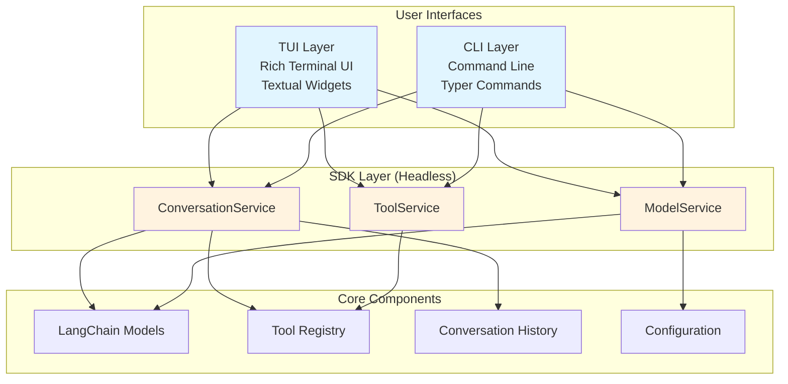
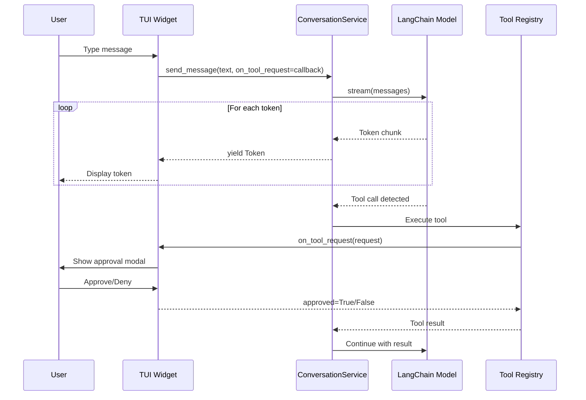
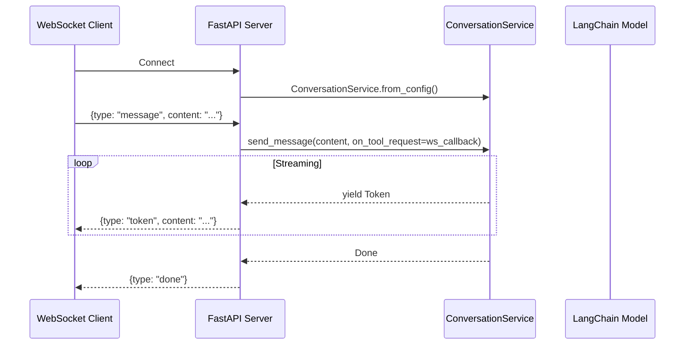

# Architecture

Consoul uses a three-layer architecture that cleanly separates business logic from presentation, enabling headless SDK usage for backend integrations while supporting rich TUI and CLI experiences.

## Overview

The architecture consists of three distinct layers:



## Layer Responsibilities

### SDK Layer

**Location**: `src/consoul/sdk/`, `src/consoul/ai/`

**Purpose**: Headless business logic with no UI dependencies

**Components**:

- **ConversationService** - AI conversation management with streaming
- **ToolService** - Tool configuration and approval management
- **ModelService** - Model initialization and switching
- **Protocols** - Callback interfaces (e.g., `ToolExecutionCallback`)
- **Models** - Data classes (e.g., `Token`, `ToolRequest`, `ConversationStats`)

**Key Characteristics**:

- ✅ No imports from `consoul.tui` or `consoul.cli`
- ✅ Async-first API design
- ✅ Protocol-based callbacks for UI integration
- ✅ Comprehensive docstrings with examples
- ✅ Unit testable with mocked dependencies

**Example**: `src/consoul/sdk/services/conversation.py:42`

```python
class ConversationService:
    """Service layer for AI conversation management.

    Provides headless conversation interface with streaming responses,
    tool execution approval, multimodal message support, and cost tracking.
    Completely decoupled from TUI/CLI to enable SDK-first architecture.
    """

    async def send_message(
        self,
        content: str,
        *,
        attachments: list[Attachment] | None = None,
        on_tool_request: ToolApprovalCallback | None = None,
    ) -> AsyncIterator[Token]:
        """Send message and stream AI response.

        Args:
            content: User message text
            attachments: Optional file attachments
            on_tool_request: Optional callback for tool execution approval

        Yields:
            Token: Streaming tokens with content, cost, and metadata
        """
        # Business logic here, no UI code
```

### TUI Layer

**Location**: `src/consoul/tui/`

**Purpose**: Rich terminal user interface using Textual framework

**Components**:

- **ConsoulApp** - Main Textual application
- **Widgets** - Custom UI components (chat display, input field, modals)
- **Screens** - Full-screen UI layouts
- **Themes** - Visual styling and color schemes

**Key Characteristics**:

- ✅ Imports SDK services for business logic
- ✅ Handles user input and presentation only
- ✅ Uses callback protocols to provide approval UI
- ✅ Integration tested with Textual test harness

**Example**: TUI widget using ConversationService

```python
from consoul.sdk.services import ConversationService
from consoul.sdk.models import ToolRequest

class ChatWidget(Widget):
    def __init__(self):
        self.service = ConversationService.from_config()

    async def send_user_message(self, message: str):
        """Send message and display streaming response."""
        # UI provides approval callback
        async for token in self.service.send_message(
            message,
            on_tool_request=self.approval_provider  # UI callback
        ):
            self.display_token(token.content)  # Presentation only
```

### CLI Layer

**Location**: `src/consoul/cli/`

**Purpose**: Command-line interface using Typer framework

**Components**:

- **Commands** - CLI command handlers
- **Arguments** - Argument parsing and validation
- **Output** - Terminal output formatting

**Key Characteristics**:

- ✅ Imports SDK services for business logic
- ✅ Handles argument parsing and simple output
- ✅ Non-interactive approval (auto-approve or deny)

**Example**: CLI command using ConversationService

```python
from consoul.sdk.services import ConversationService
import typer

app = typer.Typer()

@app.command()
def chat(message: str):
    """Send a chat message."""
    service = ConversationService.from_config()

    async for token in service.send_message(message):
        print(token.content, end="", flush=True)  # Output only
```

## Architecture Boundaries

### Import Rules

**SDK Layer** (`src/consoul/sdk/`, `src/consoul/ai/`):

- ✅ Can import: `langchain`, `pydantic`, standard library
- ❌ Cannot import: `consoul.tui`, `consoul.cli`, `textual`, `typer`, `rich`

**TUI Layer** (`src/consoul/tui/`):

- ✅ Can import: `consoul.sdk`, `consoul.ai`, `textual`, `rich`
- ❌ Cannot import: `consoul.cli`

**CLI Layer** (`src/consoul.cli/`):

- ✅ Can import: `consoul.sdk`, `consoul.ai`, `typer`
- ❌ Cannot import: `consoul.tui`, `textual`, `rich`

### Where Code Belongs

| Feature | SDK Layer | TUI Layer | CLI Layer |
|---------|-----------|-----------|-----------|
| AI conversation logic | ✅ ConversationService | ❌ | ❌ |
| Token streaming | ✅ AsyncIterator[Token] | ❌ | ❌ |
| Tool execution | ✅ ToolService | ❌ | ❌ |
| Model switching | ✅ ModelService | ❌ | ❌ |
| User approval UI | ❌ | ✅ Modal dialog | ❌ |
| Message display | ❌ | ✅ Chat widget | ✅ print() |
| Command parsing | ❌ | ❌ | ✅ Typer |
| Configuration loading | ✅ load_config() | Calls SDK | Calls SDK |

## Data Flow

### Message Flow (TUI Example)



### Backend Integration Flow (FastAPI Example)



## Good vs Bad Examples

### ❌ Bad: Business Logic in UI

```python
class ChatWidget(Widget):
    async def send_message(self, msg: str):
        # BAD: AI logic in UI layer
        from langchain_openai import ChatOpenAI
        model = ChatOpenAI(model="gpt-4o")

        # BAD: Direct model interaction
        response = await model.ainvoke([{"role": "user", "content": msg}])

        # BAD: Tool execution in UI
        if response.tool_calls:
            for tool_call in response.tool_calls:
                result = self.execute_tool(tool_call)  # UI shouldn't do this

        self.display(response.content)
```

**Problems**:
- Business logic coupled to UI
- Cannot be used headlessly
- Hard to unit test
- Code duplication with CLI

### ✅ Good: Service Handles Logic

```python
class ChatWidget(Widget):
    def __init__(self):
        # GOOD: Use SDK service
        self.service = ConversationService.from_config()

    async def send_message(self, msg: str):
        # GOOD: Service handles all AI logic
        async for token in self.service.send_message(
            msg,
            on_tool_request=self.approval_provider  # UI provides callback
        ):
            # GOOD: UI only displays
            self.display_token(token.content)
```

**Benefits**:
- Business logic in SDK layer
- Same service used in TUI, CLI, FastAPI, etc.
- Easy to unit test services
- UI code is simple and focused

### ❌ Bad: SDK Importing UI

```python
# src/consoul/sdk/services/conversation.py

from rich.console import Console  # BAD: UI dependency in SDK

class ConversationService:
    def __init__(self):
        self.console = Console()  # BAD: Couples to Rich

    async def send_message(self, msg: str):
        self.console.print("[bold]Sending...[/bold]")  # BAD: UI in service
        # ...
```

**Problems**:
- SDK cannot be used in FastAPI/WebSocket (Rich requires terminal)
- Breaks headless usage
- Forces UI choice on SDK consumers

### ✅ Good: Protocol-Based Callbacks

```python
# src/consoul/sdk/protocols.py

class ToolExecutionCallback(Protocol):
    """Protocol for tool execution approval."""
    async def on_tool_request(self, request: ToolRequest) -> bool:
        """Called when tool execution needs approval."""
        ...

# src/consoul/sdk/services/conversation.py

class ConversationService:
    async def send_message(
        self,
        msg: str,
        on_tool_request: ToolExecutionCallback | None = None
    ):
        # Service calls protocol method, UI provides implementation
        if on_tool_request:
            approved = await on_tool_request.on_tool_request(request)
```

**Benefits**:
- SDK defines contract (protocol)
- UI provides implementation (modal, WebSocket, CLI, etc.)
- Loose coupling via protocol
- Supports any approval mechanism

## Integration Patterns

### FastAPI WebSocket Integration

See `examples/fastapi_websocket_server.py` for full example:

```python
from fastapi import FastAPI, WebSocket
from consoul.sdk.services import ConversationService

app = FastAPI()

@app.websocket("/ws/chat")
async def websocket_chat(websocket: WebSocket):
    await websocket.accept()

    # Create service per connection
    service = ConversationService.from_config()

    # Stream responses
    async for token in service.send_message(user_message):
        await websocket.send_json({"token": token.content})
```

### Custom Approval Provider

Implement the `ToolExecutionCallback` protocol for custom approval logic:

```python
from consoul.sdk.protocols import ToolExecutionCallback
from consoul.sdk.models import ToolRequest

class WebSocketApprovalProvider:
    def __init__(self, websocket):
        self.websocket = websocket

    async def on_tool_request(self, request: ToolRequest) -> bool:
        # Send approval request to WebSocket client
        await self.websocket.send_json({
            "type": "tool_request",
            "id": request.id,
            "name": request.name,
            "risk_level": request.risk_level
        })

        # Wait for client response
        response = await self.websocket.receive_json()
        return response.get("approved", False)

# Use in service
async for token in service.send_message(
    msg,
    on_tool_request=WebSocketApprovalProvider(websocket)
):
    # ...
```

## Testing Strategy

See [testing.md](testing.md) for detailed testing guidelines.

### SDK Layer Testing

**Unit tests** with mocked dependencies:

```python
import pytest
from unittest.mock import AsyncMock, Mock
from consoul.sdk.services import ConversationService

@pytest.mark.asyncio
async def test_conversation_service_streaming():
    # Mock LangChain model
    mock_model = Mock()
    mock_model.stream = Mock(return_value=[
        Mock(content="Hello"),
        Mock(content=" world")
    ])

    # Create service with mocked model
    service = ConversationService(
        model=mock_model,
        conversation=mock_conversation,
        tool_registry=None
    )

    # Test streaming
    tokens = []
    async for token in service.send_message("Hi"):
        tokens.append(token.content)

    assert "".join(tokens) == "Hello world"
    mock_model.stream.assert_called_once()
```

### TUI Layer Testing

**Integration tests** with Textual test harness:

```python
from textual.widgets import Input
from consoul.tui.app import ConsoulApp

async def test_tui_message_send():
    app = ConsoulApp()
    async with app.run_test() as pilot:
        # Type message
        await pilot.press("i")  # Enter input mode
        await pilot.press(*"Hello AI")
        await pilot.press("enter")

        # Verify message displayed
        assert "Hello AI" in app.query_one(ChatDisplay).text
```

## Common Pitfalls

### ❌ Pitfall: Importing Rich in SDK

**Problem**: `from rich.console import Console` in SDK layer

**Why it's bad**: Rich requires a terminal, breaks headless usage

**Solution**: Use protocols and let UI provide display logic

### ❌ Pitfall: Business Logic in TUI

**Problem**: Direct LangChain calls in TUI widgets

**Why it's bad**: Logic cannot be reused in CLI or backends

**Solution**: Move logic to ConversationService, call from TUI

### ❌ Pitfall: Blocking Calls in Services

**Problem**: Using synchronous I/O in service methods

**Why it's bad**: Blocks event loop in TUI and async servers

**Solution**: Use async methods and `asyncio.run_in_executor()` for sync code

## Next Steps

- **[Service Layer Guide](service-layer.md)** - Learn when and how to extend services
- **[Testing Guide](testing.md)** - Comprehensive testing patterns for each layer
- **[API Reference](../api/reference.md)** - Service layer API documentation
- **[SDK Integration Examples](../api/integration-guide.md)** - Real-world integration patterns
