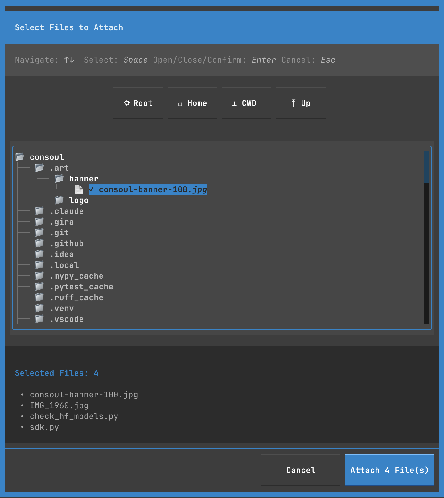

# TUI Features

This guide explores the powerful features available in the Consoul Terminal User Interface.

## Conversation Management

### Creating Conversations

Every time you start Consoul or press `^n`, a new conversation begins.

```bash
# Launch with new conversation
consoul tui
```

**Features:**
- Unlimited conversations
- Automatic persistence
- Context maintained across messages
- Auto-generated titles after first exchange

### Conversation Titles

Conversations are automatically titled based on content:

```
Initial: "Conversation (2 messages)"
After AI analysis: "Debugging Python Import Error"
```

**Title Generation:**
- Triggered after first AI response
- Based on conversation content and intent
- Updates conversation card in sidebar
- Can be manually renamed (future feature)

### Switching Conversations

**Via Sidebar:**
1. Toggle sidebar with `^b` or click conversation count
2. Click any conversation card
3. Previous conversation is saved automatically

**Via Keyboard:**
- `^n`: New conversation
- Navigate sidebar with arrow keys (when focused)

### Searching Conversations

Find conversations quickly:

1. Click or focus the search bar (🔍)
2. Type search query
3. Sidebar auto-shows with filtered results
4. Clear search with `Esc`

**Search Features:**
- Real-time filtering
- Case-insensitive
- Searches conversation titles
- Updates as you type

### Deleting Conversations

Currently via config file (UI coming soon):

```yaml
# Remove conversation from config
conversations:
  - id: "uuid-to-delete"  # Delete this entry
```

## Message Features

### Streaming Responses

AI responses stream in real-time:

```
Assistant is typing...

In terminal's grace, a cha█
```

**Indicators:**
- Blinking cursor during streaming
- Character-by-character display
- Syntax highlighting updates live
- Token rate displayed after completion

### Message Metadata

Each message includes rich metadata:

```
⏱ 16:13:59 | 34.16 tok/sec | 187 tokens | 1.27s to first token
```

**Metadata Components:**
- Timestamp (toggleable)
- Tokens per second
- Total token count (toggleable)
- Time to first token
- Cost (if available)

### Copying Messages

Copy message content to clipboard:

1. Click the copy button (📋) on any message
2. Or use keyboard shortcut when message focused
3. Confirmation feedback shown
4. Includes formatted text (markdown preserved)

### Branching Conversations

> **Future Feature**: Create alternate conversation paths from any point in a conversation. This feature is planned but not yet implemented.

## Tool Execution

### Visual Tool Calls

Tool executions are displayed as interactive widgets:


```
┌─ System ──────────────────────┐
│ 🔧 Executing: read_file       │
│                                │
│ Arguments:                     │
│ {                              │
│   "file_path": "README.md"     │
│ }                              │
│                                │
│ Status: ✅ Success             │
│                                │
│ Output:                        │
│ # Consoul                      │
│ ...                            │
└────────────────────────────────┘
```

### Tool Status Lifecycle

Tools progress through states:

1. **Pending** (⏳ Yellow) - Tool call received, awaiting approval
2. **Executing** (⚙️ Blue) - Tool is running
3. **Success** (✅ Green) - Completed successfully
4. **Error** (❌ Red) - Failed with error
5. **Denied** (🚫 Gray) - User denied execution

### Tool Approval Workflow

For CAUTION and DANGEROUS tools:

```
┌─ Tool Approval Required ──────────────┐
│                                        │
│ 🔧 bash_execute                        │
│                                        │
│ Command: rm -rf /tmp/cache             │
│                                        │
│ ⚠️ Risk Level: CAUTION                 │
│                                        │
│ Allow this tool to execute?            │
│                                        │
│ [Approve]  [Deny]  [View Details]     │
└────────────────────────────────────────┘
```

**Approval Options:**
- **Approve**: Execute this time only
- **Deny**: Reject execution
- **View Details**: See tool description and arguments
- **Always Allow**: Add to whitelist (future)

### Tool Output

Tool results are shown directly in the widget:

```
Output:
Removed 247 files
Freed 1.2 GB
```

**Features:**
- Syntax highlighting for code output
- Scrollable for long output
- Expandable/collapsible
- Copy button for output

## File Attachments

### Attaching Files

Add context files to your messages:



**Methods:**
1. Click `+ Attach` button in input area
2. Select files in browser modal

### File Browser

Navigate filesystem to select files:

```
┌─ Select Files to Attach ──────────────┐
│                                        │
│ Navigate: ↑↓  Select: Space           │
│ Open/Close/Confirm: Enter             │
│                                        │
│ ✱ Root  🏠 Home  📁 CWD  ↑ Up        │
│                                        │
│ ┌──────────────────────────────────┐ │
│ │ 📁 consoul                        │ │
│ │   📁 .art                         │ │
│ │   📁 .git                         │ │
│ │   📁 src                          │ │
│ │   ✓ 📄 README.md                 │ │
│ │   ✓ 📄 pyproject.toml            │ │
│ └──────────────────────────────────┘ │
│                                        │
│ Selected Files: 2                      │
│ • README.md                            │
│ • pyproject.toml                       │
│                                        │
│ [Cancel]  [Attach 2 File(s)]          │
└────────────────────────────────────────┘
```

**Navigation:**
- **↑↓**: Move up/down
- **→**: Expand directory
- **←**: Collapse directory
- **Space**: Toggle file selection
- **Enter**: Open directory or confirm
- **Esc**: Cancel

**Quick Jump:**
- **✱ Root**: Navigate to `/`
- **🏠 Home**: Navigate to `~`
- **📁 CWD**: Navigate to current working directory
- **↑ Up**: Go to parent directory

### File Chips

Selected files shown as chips in input area:

```
[📄 main.py ×] [📄 config.yaml ×] [📄 utils.py ×]
```

**Chip Actions:**
- Click `×` to remove file
- Hover for highlight
- Auto-wrap to multiple lines if needed

### File Context

Attached files are sent with your message:

```
User: Review this code
Attachments:
  - main.py (1.2 KB)
  - test_main.py (800 B)
```

**Processing:**
- File contents read automatically
- Syntax detection
- Included in AI context
- Token count includes file content

## Display Settings

### Timestamps

Toggle message timestamps:

```
⏱ 16:13:59
```

**Settings → Appearance → Show Timestamps**
- On: Show timestamp on every message
- Off: Hide timestamps (cleaner UI)

### Token Counts

Toggle token usage display:

```
34.16 tok/sec | 187 tokens
```

**Settings → Appearance → Show Token Count**
- On: Show tokens, rate, and metrics
- Off: Hide token information

### Sidebar Visibility

Toggle conversation list sidebar:

**Methods:**
- Click conversation count in header
- Press `^b`
- Click search bar (auto-shows)
- Settings → Appearance → Show Sidebar

**Behavior:**
- Persisted across sessions
- Auto-hides when empty
- Auto-shows on search
- Smooth animation

### Syntax Highlighting

Toggle code syntax highlighting:

**Settings → Appearance → Input Syntax Highlighting**
- On: Highlight code in input area
- Off: Plain text (faster on slow terminals)

**Features:**
- Python, JavaScript, Shell, and more
- Auto-detection
- Theme-aware colors

## Performance Features

### Efficient Rendering

The TUI only renders visible elements:

- Virtual scrolling for long conversations
- Lazy loading of conversation list
- Incremental updates during streaming
- Optimized redraws

### Token Streaming

Responses stream efficiently:

- Real-time display
- Minimal latency
- Smooth scrolling
- Auto-scroll to latest

### Caching

Conversations cached in memory:

- Fast switching
- Instant load of recent conversations
- Periodic persistence to disk
- Automatic cleanup of old conversations

## Export Features

Export conversations to various formats:


### Export Formats

**Markdown** (`.md`)
```markdown
# Conversation: Debugging Python Import Error

## User (16:13:59)
I'm getting an import error...

## Assistant (16:14:02)
Let me help you debug...
```

**JSON** (`.json`)
```json
{
  "conversation_id": "uuid",
  "title": "Debugging Python Import Error",
  "messages": [
    {
      "role": "user",
      "content": "I'm getting...",
      "timestamp": "2025-11-26T16:13:59Z"
    }
  ]
}
```

**Text** (`.txt`)
```
Conversation: Debugging Python Import Error
Date: 2025-11-26

[User - 16:13:59]
I'm getting an import error...

[Assistant - 16:14:02]
Let me help you debug...
```

### Export Options

- Include/exclude metadata
- Include/exclude timestamps
- Include/exclude tool calls
- Include/exclude system messages
- Custom filename

## Advanced Features

### Thinking Display

Extended reasoning shown during generation:

```
┌─ Thinking... ─────────────────┐
│ Let me analyze the error...    │
│                                │
│ The traceback shows...         │
│                                │
│ ⚙️ ⚙️ ⚙️                      │
└────────────────────────────────┘
```

**Features:**
- Real-time streaming of thoughts
- Collapsible after completion
- Dashed border for distinction
- Italic muted text

### Multi-turn Context

Context maintained across messages:

```
User: What files are in /tmp?
Assistant: [Lists files]

User: Delete the cache files
Assistant: [Remembers previous /tmp context]
```

**Features:**
- Automatic context window management
- Conversation history included
- Tool results preserved
- File attachments remembered

### Error Handling

Graceful error display:

```
┌─ Error ────────────────────────┐
│ ❌ API Request Failed          │
│                                │
│ Rate limit exceeded            │
│ Retry after 60 seconds         │
│                                │
│ [Retry]  [Cancel]              │
└────────────────────────────────┘
```

**Error Types:**
- API errors (rate limit, auth, network)
- Tool execution errors
- File I/O errors
- Validation errors

### Auto-save

Conversations automatically saved:

- After each message
- On conversation switch
- On application quit
- On error/crash (recovery)

**Location:**
```
~/.config/consoul/conversations/
```

## Keyboard-Driven Workflow

Power users can work entirely via keyboard:

```
^n               → New conversation
Type message     → Compose
Enter            → Send
^f               → Attach files
Space            → Select files
Enter            → Confirm
Tab              → Cycle through UI
^s               → Settings
^b               → Toggle sidebar
q                → Quit
```

[Complete keyboard reference →](keyboard-shortcuts.md)

## Next Steps

- [Keyboard Shortcuts](keyboard-shortcuts.md) - Master keyboard navigation
- [Modals & Dialogs](modals.md) - Settings, tools, model selection
- [Themes](themes.md) - Customize appearance
- [Configuration](configuration.md) - Configure behavior
