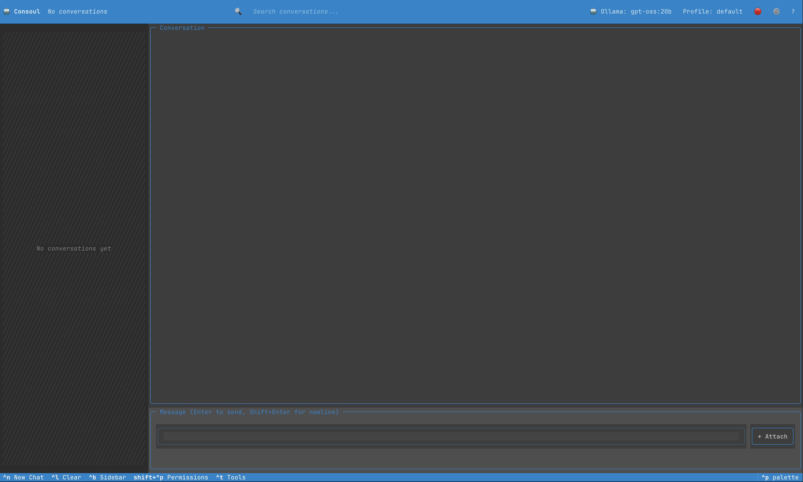
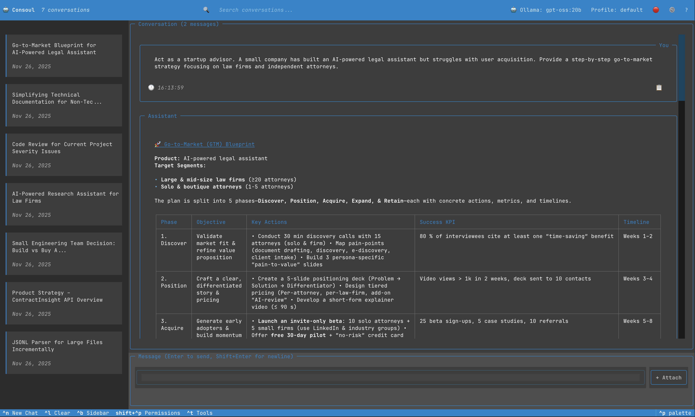
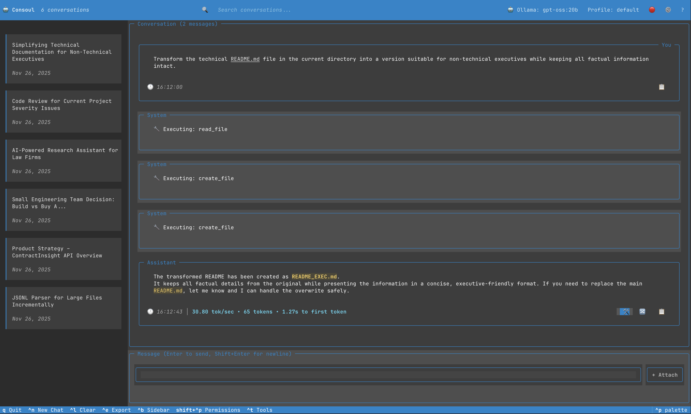

# TUI Interface Guide

This guide provides a detailed walkthrough of every component in the Consoul Terminal User Interface.

## Interface Overview



The Consoul TUI is organized into five main areas:

1. **Header Bar** (top)
2. **Conversation Sidebar** (left, toggleable)
3. **Chat Area** (center)
4. **Input Area** (bottom)
5. **Footer** (very bottom)

## 1. Header Bar

The header bar spans the full width of the terminal and provides navigation and context information.

### Components

#### App Icon & Name
```
🤖 Consoul
```
- Click to toggle sidebar (same as clicking conversation count)
- Brand identity and visual anchor

#### Conversation Count
```
7 conversations
```
- Shows total number of saved conversations
- Click to toggle sidebar visibility
- Updates in real-time as conversations are created/deleted

#### Search Bar
```
🔍 Search conversations...
```
- Filter conversations by title
- Auto-shows sidebar when search query is entered
- Real-time filtering as you type
- Clear with `Esc` or clear button

#### Model Indicator
```
🤖 Ollama: qpt-oss:20b
```
- Shows currently selected provider and model
- Click to open model selector modal
- Format: `Provider: model-name`

#### Profile Indicator
```
Profile: default
```
- Shows active profile
- Click to open profile selector
- Profiles control behavior, tools, and settings

#### Quick Actions
```
🔴 ⚙️  ?
```
- **🔴 Red Dot**: Record/stop (future feature)
- **⚙️ Settings**: Open settings modal (`^comma`)
- **? Help**: Show help/keyboard shortcuts

## 2. Conversation Sidebar

Toggleable sidebar showing all conversations as beautiful cards.


### Empty State
When no conversations exist:
```
╱╱╱╱╱╱╱╱╱╱
╱         ╱
╱ No conv ╱
╱ -ersati╱
╱ ons yet╱
╱╱╱╱╱╱╱╱╱
```
- Diagonal hatch pattern
- Centered italic text
- Automatically hidden when empty

### Conversation Cards

Each conversation is displayed as a card:

```
┌────────────────────────────┐
│ Poem from Project README   │
│                            │
│ Nov 26, 2025              │
└────────────────────────────┘
```

#### Card States

**Default**

- Gray background
- Blue left border
- Two-line title support (wraps automatically)
- Date in muted gray

**Hover**

- Lighter background
- Cyan accent border
- Enhanced visual feedback

**Selected/Active**

- Blue background
- Purple left border
- Bold text style
- Indicates current conversation

### Sidebar Actions

- **Click Card**: Load that conversation
- **Click Count**: Toggle sidebar
- **Search**: Filter cards by title
- **Scroll**: Navigate through many conversations

### Sidebar Behavior

- Minimum width: 20 characters
- Maximum width: 40 characters
- Default width: 20% of terminal
- Auto-shows when searching
- Persists state (visible/hidden) in config

## 3. Chat Area

The main conversation display area showing message history.



### Layout

```
╔══════════════════════════════════════════╗
║ Conversation (2 messages)                ║
╠══════════════════════════════════════════╣
║                                          ║
║  ┌─ You ────────────────────────────┐  ║
║  │ Write a poem...                   │  ║
║  │ ⏱ 16:13:59                  📋 ⎘  │  ║
║  └───────────────────────────────────┘  ║
║                                          ║
║  ┌─ Assistant ──────────────────────┐  ║
║  │ In terminal's grace, a chat...   │  ║
║  │                                   │  ║
║  │ ⏱ 17:00:11 | 34.16 tok/sec       │  ║
║  │             187 tokens            │  ║
║  │ 🔧 📋 ⎘                          │  ║
║  └───────────────────────────────────┘  ║
║                                          ║
╚══════════════════════════════════════════╝
```

### Message Bubbles

All messages are displayed as bordered containers with metadata.

#### User Messages

```
┌─ You ──────────────────────────────────┐
│ What files are in the current directory?│
│                                          │
│ ⏱ 14:23:45                         📋  ⎘│
└──────────────────────────────────────────┘
```

**Characteristics:**

- Blue border (primary color)
- Title aligned right: "You"
- Timestamp in bottom left
- Copy button (📋) in bottom right
- Branch button (⎘) for conversation branching

#### Assistant Messages

```
┌─ Assistant ────────────────────────────┐
│ Here are the files:                    │
│                                        │
│ - main.py                              │
│ - config.yaml                          │
│ - README.md                            │
│                                        │
│ ⏱ 14:23:48 | 45.2 tok/sec | 28 tokens│
│ 🔧 📋 ⎘                               │
└────────────────────────────────────────┘
```

**Characteristics:**

- Purple border (secondary color #44385E)
- Title aligned left: "Assistant"
- Markdown rendering
- Syntax highlighting for code blocks
- Token metrics (if enabled)
- Tools button (🔧) to show tool calls
- Copy and branch buttons

#### System Messages

```
┌─ System ───────────────────────────────┐
│ ⚙️ Executing: read_file                │
└────────────────────────────────────────┘
```

**Characteristics:**

- Muted border and colors
- Lighter background
- Icon-based status indicators
- Compact display

#### Error Messages

```
┌─ Error ────────────────────────────────┐
│ ❌ Failed to execute command           │
│                                        │
│ Permission denied: /etc/shadow         │
└────────────────────────────────────────┘
```

**Characteristics:**

- Red background
- Thick yellow border
- Error icon
- Error details

### Tool Call Widgets

Tool executions are shown as special expandable widgets:



```
┌─ System ──────────────────────┐
│ 🔧 Executing: read_file       │
└───────────────────────────────┘

┌─ System ──────────────────────┐
│ 🔧 Executing: create_file     │
└───────────────────────────────┘
```

#### Tool Status Colors

| Status | Border Color | Indicator |
|--------|--------------|-----------|
| Pending | Yellow/Amber | ⏳ |
| Executing | Blue/Primary | ⚙️ |
| Success | Green | ✅ |
| Error | Red (thick) | ❌ |
| Denied | Gray/Muted | 🚫 |

#### Tool Widget Structure

```
┌─ Tool: bash_execute ──────────────────┐
│ 🔧 bash_execute                        │
│                                        │
│ Arguments:                             │
│ {                                      │
│   "command": "ls -la"                  │
│ }                                      │
│                                        │
│ Status: ✅ Success                     │
│                                        │
│ Output:                                │
│ total 48                               │
│ drwxr-xr-x  12 user  staff  384 Nov 25│
│ -rw-r--r--   1 user  staff  1.2K README│
│ ...                                    │
└────────────────────────────────────────┘
```

### Thinking Indicators

When the AI is processing (extended thinking):

```
┌─ Thinking... ─────────────────┐
│ Analyzing the code...          │
│                                │
│ ⚙️ ⚙️ ⚙️                      │
└────────────────────────────────┘
```

**Features:**

- Dashed blue border
- Animated dots
- Real-time streaming of thinking content
- Collapsible after completion

### Markdown Rendering

Assistant messages support rich markdown:

- **Headers** (H1-H6)
- **Lists** (ordered, unordered, nested)
- **Code Blocks** (with syntax highlighting)
- **Inline Code** (`code`)
- **Tables**

- **Links**

- **Emphasis** (*italic*, **bold**)
- **Blockquotes**

### Code Blocks

```python
┌─ Python ───────────────────────┐
│ def fibonacci(n):              │
│     if n <= 1:                 │
│         return n               │
│     return fib(n-1) + fib(n-2) │
└────────────────────────────────┘
```

**Features:**

- Language detection
- Syntax highlighting (Pygments)
- Line numbers (optional)
- Copy button
- Scrollable for long code

## 4. Input Area

Multi-line text input with file attachment support.

### Components

```
╔══════════════════════════════════════════╗
║ Message (Enter to send, Shift+Enter for  ║
║ newline)                                  ║
╠══════════════════════════════════════════╣
║ ┌────────────────────────────────────┐  ║
║ │ Your message here...                │  ║
║ │                                      │  ║
║ └────────────────────────────────────┘  ║
║                                          ║
║ [main.py ×] [config.yaml ×]     [+ Attach]║
╚══════════════════════════════════════════╝
```

#### Text Area

- Multi-line support (up to 10 lines)
- Auto-scroll on overflow
- Syntax highlighting for code (if enabled)
- Blue border (primary color)
- Focus indicator (30% opacity border)

#### File Chips

Attached files shown as removable chips:

```
[📄 main.py ×] [📄 config.yaml ×] [📄 utils.py ×]
```

**Features:**

- File icon
- Filename
- Remove button (×)
- Hover effects
- Auto-wrap to multiple lines

#### Attach Button

```
[ + Attach ]
```

- Opens file browser modal
- Click to open file browser
- Hover effect (lighter background)

### Input Behavior

- `Enter`: Send message
- `Shift+Enter`: New line
- Click `+ Attach`: Open file browser modal
- Auto-focus after sending
- History preserved per conversation

## 5. Footer

Quick keyboard shortcuts and status bar.

```
q Quit   ^n New Chat   ^l Clear   ^e Export   ^b Sidebar   shift+^p Permissions   ^t Tools   ^comma Settings
```

### Footer Elements

Each shows a keyboard shortcut and action:

| Shortcut | Label | Action |
|----------|-------|--------|
| `q` | Quit | Exit Consoul |
| `^n` | New Chat | Create new conversation |
| `^l` | Clear | Clear current conversation |
| `^e` | Export | Export conversation |
| `^b` | Sidebar | Toggle sidebar |
| `shift+^p` | Permissions | Open permissions/tool manager |
| `^t` | Tools | Open tool manager |
| `^comma` | Settings | Open settings (Ctrl+,) |

### Footer Styling

- Background: Primary color (Sky Blue #0085CC)
- Text: White
- Shortcut keys: Bold, same color as text
- Auto-wraps on narrow terminals

## Responsive Layout

The TUI adapts to different terminal sizes:

### Minimum Size
- Width: 80 characters
- Height: 24 lines
- Sidebar auto-hides below 100 chars width

### Recommended Size
- Width: 120+ characters
- Height: 40+ lines
- Full feature visibility

### Maximum Utilization
- Sidebar: Max 40 chars width
- Chat area: Remaining space
- Input: Max 10 lines height
- All components scale proportionally

## Color Scheme

The interface uses theme-based colors:

### Consoul Dark (Default)

- **Background**: #2A2A2A (dark gray)
- **Surface**: #3D3D3D (Binary Slate)
- **Primary**: #0085CC (Sky Blue)
- **Secondary**: #44385E (Deep Purple)
- **Text**: #FFFFFF (Pure White)
- **Muted**: #9BA3AB (Light Gray)

### Consoul Light

- **Background**: #FFFFFF (Pure White)
- **Surface**: #F8F9FA (Very Light Gray)
- **Primary**: #0085CC (Sky Blue)
- **Secondary**: #3D3D3D (Binary Slate)
- **Text**: #3D3D3D (Binary Slate)
- **Muted**: #6C757D (Gray)

[See all themes →](themes.md)

## Accessibility

### Keyboard Navigation

- All actions accessible via keyboard
- Visible focus indicators
- No mouse required

### Visual Indicators

- Color is never the only indicator
- Icons supplement color-coded statuses
- Borders and styling for clarity

### Performance

- Efficient rendering (only visible elements)
- Smooth scrolling
- Responsive even with long conversations

## Next Steps

- [TUI Features](features.md) - Deep dive into functionality
- [Keyboard Shortcuts](keyboard-shortcuts.md) - Complete shortcut reference
- [Themes](themes.md) - Customize appearance
- [Configuration](configuration.md) - Configure TUI settings
