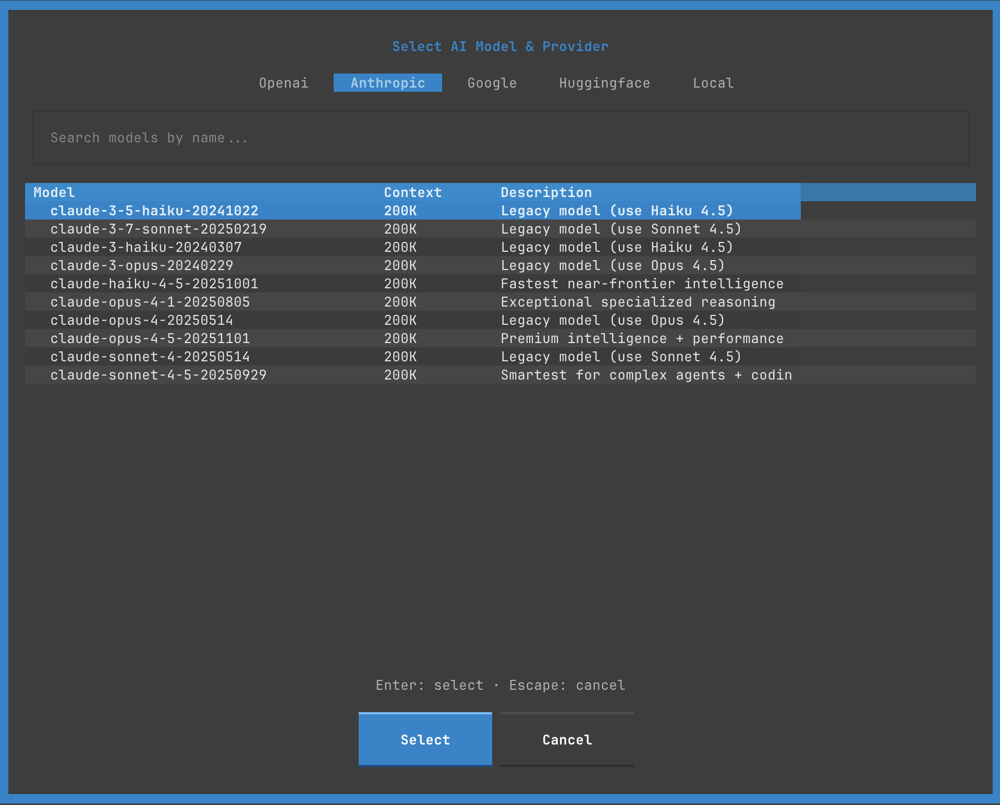

# Modals & Dialogs

Consoul TUI features several modal dialogs for configuration and interaction. This guide covers each modal in detail.

## Model Selector

Select AI model and provider.



### Opening the Modal

**Methods:**
- Click the model indicator in header
- Press `^m`

### Layout

```
╔═══════════════════════════════════════════════════╗
║         Select AI Model & Provider                ║
╠═══════════════════════════════════════════════════╣
║ [Openai] [Anthropic] [Google] [HuggingFace] [Local] ║
╠═══════════════════════════════════════════════════╣
║ 🔍 Search models by name...                      ║
╠═══════════════════════════════════════════════════╣
║ Model                    Context    Description   ║
║ ━━━━━━━━━━━━━━━━━━━━━━━━━━━━━━━━━━━━━━━━━━━━━━ ║
║ claude-3-5-haiku...      200K      Legacy model  ║
║ claude-3-7-sonnet...     200K      Legacy model  ║
║ claude-haiku-4-5...      200K      Fastest near..║
║ claude-opus-4-1...       200K      Exceptional.. ║
║ claude-sonnet-4...       200K      Legacy model  ║
║ claude-sonnet-4-5...     200K      Smartest for..║
╠═══════════════════════════════════════════════════╣
║ Enter: select · Escape: cancel                    ║
╠═══════════════════════════════════════════════════╣
║              [Select]    [Cancel]                 ║
╚═══════════════════════════════════════════════════╝
```

### Provider Tabs

Switch between AI providers:

**Anthropic (Claude)**


- claude-3-5-haiku-20241022 (Legacy, use Haiku 4.5)
- claude-3-7-sonnet-20250219 (Legacy, use Sonnet 4.5)
- claude-3-haiku-20240307 (Legacy, use Haiku 4.5)
- claude-3-opus-20240229 (Legacy, use Opus 4.5)
- claude-haiku-4-5-20251001 (Fastest near-frontier intelligence)
- claude-opus-4-1-20250805 (Exceptional specialized reasoning)
- claude-opus-4-20250514 (Legacy, use Opus 4.5)
- claude-opus-4-5-20251101 (Premium intelligence + performance)
- claude-sonnet-4-20250514 (Legacy, use Sonnet 4.5)
- claude-sonnet-4-5-20250929 (Smartest for complex agents + coding)

**OpenAI (GPT)**


- gpt-4o
- gpt-4o-mini
- gpt-4-turbo
- gpt-4
- gpt-3.5-turbo
- o1-preview
- o1-mini

**Google (Gemini)**

- gemini-2.0-flash-exp
- gemini-1.5-pro
- gemini-1.5-flash
- gemini-1.0-pro

**Local (Ollama)**


- Lists locally installed Ollama models
- Shows model size and quantization
- Auto-detects available models

### Model Information

Each model shows:

| Column | Description |
|--------|-------------|
| **Model** | Full model identifier |
| **Context** | Context window size (e.g., 200K tokens) |
| **Description** | Model capabilities and use cases |

### Search

Filter models by name:

1. Focus search bar (`/` or click)
2. Type model name or keyword
3. Results filter in real-time
4. Clear with `Esc`

**Search Examples:**
- "sonnet" → Claude Sonnet models
- "4o" → GPT-4o variants
- "flash" → Gemini Flash models
- "7b" → 7 billion parameter local models

### Selection

**Keyboard:**
1. Navigate with `↑` `↓`
2. Switch tabs with `Tab` or `1`-`5`
3. Press `Enter` to select
4. Press `Esc` to cancel

**Mouse:**
1. Click provider tab
2. Click model row
3. Click `Select` button

### Configuration

Selected model is saved:

```yaml
# config.yaml
default_model: claude-sonnet-4-5-20250929
```

## Settings Modal

Configure TUI appearance and behavior.


### Opening the Modal

**Methods:**
- Press `^comma` (Ctrl+,)
- Click settings icon (⚙️) in header

### Settings Tabs

#### 1. Appearance

```
╔═══════════════════════════════════════════╗
║               Settings                    ║
╠═══════════════════════════════════════════╣
║ [Appearance] Performance  Behavior  Adv.. ║
╠═══════════════════════════════════════════╣
║                                           ║
║ Theme:                                    ║
║     ▼ Consoul Dark ▼                     ║
║                                           ║
║ Show Sidebar:                             ║
║     ☑ Enabled                            ║
║                                           ║
║ Show Timestamps:                          ║
║     ☑ Enabled                            ║
║                                           ║
║ Show Token Count:                         ║
║     ☑ Enabled                            ║
║                                           ║
║ Input Syntax Highlighting:                ║
║     ☑ Enabled                            ║
║                                           ║
╠═══════════════════════════════════════════╣
║ Saving to global config: config.yaml     ║
╠═══════════════════════════════════════════╣
║        [Apply]  [Reset]  [Cancel]        ║
╚═══════════════════════════════════════════╝
```

**Options:**
- **Theme**: Choose from available themes (dropdown)
- **Show Sidebar**: Toggle conversation list visibility
- **Show Timestamps**: Display message timestamps
- **Show Token Count**: Display token usage metrics
- **Input Syntax Highlighting**: Highlight code in input

#### 2. Performance

```
Performance Settings:

• Stream Tokens:          ☑ Enabled
• Async Rendering:        ☑ Enabled
• Virtual Scrolling:      ☑ Enabled
• Cache Conversations:    ☑ Enabled
• Max Cached:             [50]
• Lazy Load Threshold:    [100] messages
```

**Options:**
- **Stream Tokens**: Real-time streaming vs batch display
- **Async Rendering**: Non-blocking UI updates
- **Virtual Scrolling**: Render only visible messages
- **Cache Conversations**: Keep recent conversations in memory
- **Max Cached**: Number of conversations to cache
- **Lazy Load Threshold**: Messages before lazy loading kicks in

#### 3. Behavior

```
Behavior Settings:

• Auto-save Conversations:     ☑ Enabled
• Confirm on Quit:             ☑ Enabled
• Confirm on Clear:            ☑ Enabled
• Auto-scroll to New:          ☑ Enabled
• Tool Execution Sound:        ☐ Disabled
• Error Notifications:         ☑ Enabled
• Auto-generate Titles:        ☑ Enabled
```

**Options:**
- **Auto-save Conversations**: Save after each message
- **Confirm on Quit**: Prompt before quitting
- **Confirm on Clear**: Prompt before clearing conversation
- **Auto-scroll to New**: Auto-scroll on new messages
- **Tool Execution Sound**: Beep on tool execution (future)
- **Error Notifications**: Show error toasts
- **Auto-generate Titles**: Generate conversation titles

#### 4. Advanced

```
Advanced Settings:

• Debug Mode:                  ☐ Disabled
• Log Level:                   ▼ INFO ▼
• API Timeout:                 [30] seconds
• Max Retries:                 [3]
• Conversation History Limit:  [100] messages
• Tool Approval Timeout:       [60] seconds
```

**Options:**
- **Debug Mode**: Enable verbose logging
- **Log Level**: DEBUG, INFO, WARNING, ERROR
- **API Timeout**: Seconds before timeout
- **Max Retries**: API retry attempts
- **Conversation History Limit**: Max messages in context
- **Tool Approval Timeout**: Seconds to approve/deny tools

### Saving Settings

**Scope:**
```
Saving to global config: config.yaml
```

Settings saved to:
```
~/.config/consoul/config.yaml
```

**Actions:**
- **Apply**: Save and apply changes
- **Reset**: Reset to defaults
- **Cancel**: Discard changes and close

## Tool Manager

Manage AI tool permissions and configuration.


### Opening the Modal

**Methods:**
- Press `^t`
- Press `shift+^p` (Permissions)
- Footer shortcut

### Layout

```
╔═══════════════════════════════════════════════════════════════════╗
║                        Tool Manager                               ║
╠═══════════════════════════════════════════════════════════════════╣
║ 13 tools (13 enabled)                                            ║
╠═══════════════════════════════════════════════════════════════════╣
║ Space/T: toggle · ↑↓: navigate · A: all · N: none · S: safe ·   ║
║ Ctrl+S: save to config · Enter: apply · Esc: cancel              ║
╠═══════════════════════════════════════════════════════════════════╣
║           [All (A)]  [None (N)]  [Safe (S)]                      ║
╠═══════════════════════════════════════════════════════════════════╣
║ Tool             Risk        Description                          ║
║ ━━━━━━━━━━━━━━━━━━━━━━━━━━━━━━━━━━━━━━━━━━━━━━━━━━━━━━━━━━━━━━ ║
║ ☑ bash_execute   CAUTION     Execute a bash command with...      ║
║ ☑ grep_search    SAFE        Search for text patterns in...      ║
║ ☑ code_search    SAFE        Search for code symbols (func...    ║
║ ☑ find_ref...    SAFE        Find all references/usages of...    ║
║ ☑ read_file      SAFE        Read file contents with line...     ║
║ ☑ create_file    CAUTION     Create new file with content.      ║
║ ☑ edit_file...   CAUTION     Edit file using line-range...       ║
║ ☑ edit_file...   CAUTION     Edit file using search/replace...   ║
║ ☑ append_to...   CAUTION     Append content to end of file.     ║
║ ☑ delete_file    DANGEROUS   Delete file (DANGEROUS - alwa...    ║
║ ☑ read_url       SAFE        Read and convert a web page to...   ║
║ ☑ web_search     SAFE        Search the web using Jina AI...    ║
║ ☑ wikipedia...   SAFE        Search Wikipedia for factual...     ║
╠═══════════════════════════════════════════════════════════════════╣
║                  [Cancel (Esc)]  [Apply (Enter)]                 ║
╚═══════════════════════════════════════════════════════════════════╝
```

### Tool List

Each tool shows:

| Column | Description |
|--------|-------------|
| **Checkbox** | ☑ Enabled / ☐ Disabled |
| **Tool Name** | Function identifier |
| **Risk Level** | SAFE / CAUTION / DANGEROUS / BLOCKED |
| **Description** | What the tool does |

### Risk Levels

| Level | Color | Approval Required | Description |
|-------|-------|-------------------|-------------|
| **SAFE** | Green | No | Read-only, no system changes |
| **CAUTION** | Yellow | Yes | Modifies files, needs review |
| **DANGEROUS** | Red | Always | Destructive operations |
| **BLOCKED** | Gray | N/A | Never allowed to execute |

### Tool Categories

**File Operations:**
- read_file (SAFE)
- create_file (CAUTION)
- edit_file_lines (CAUTION)
- edit_file_search_replace (CAUTION)
- append_to_file (CAUTION)
- delete_file (DANGEROUS)

**Search & Discovery:**
- grep_search (SAFE)
- code_search (SAFE)
- find_references (SAFE)

**Execution:**
- bash_execute (CAUTION)

**Web & Information:**
- read_url (SAFE)
- web_search (SAFE)
- wikipedia_search (SAFE)

### Quick Actions

**Preset Configurations:**

```
[All (A)]   → Enable all tools (13/13)
[None (N)]  → Disable all tools (0/13)
[Safe (S)]  → Enable only SAFE tools (6/13)
```

**Keyboard Shortcuts:**
- `Space` or `T`: Toggle selected tool
- `A`: Enable all tools
- `N`: Disable all tools
- `S`: Enable only SAFE tools
- `^s`: Save to config file

### Tool Details

Click or press `Space` on a tool to see details (future):

```
╔═══════════════════════════════════════════╗
║        Tool Details: bash_execute         ║
╠═══════════════════════════════════════════╣
║                                           ║
║ Risk Level: CAUTION                       ║
║                                           ║
║ Description:                              ║
║ Execute a bash command with security      ║
║ controls. Requires user approval for      ║
║ potentially dangerous operations.         ║
║                                           ║
║ Parameters:                               ║
║ • command (str): Shell command to run     ║
║                                           ║
║ Approval Required: Yes                    ║
║                                           ║
║ Examples:                                 ║
║ • ls -la                                  ║
║ • git status                              ║
║ • python script.py                        ║
║                                           ║
║                  [Close]                  ║
╚═══════════════════════════════════════════╝
```

### Saving Configuration

**Temporary (Session Only):**
- Click `Apply` or press `Enter`
- Tools enabled/disabled for this session
- Reset on restart

**Permanent (Config File):**
- Press `^s` or click `Save to Config`
- Writes to `config.yaml`:

```yaml
tools:
  enabled:
    - bash_execute
    - grep_search
    - code_search
    - read_file
    # ... only enabled tools listed
```

## File Attachment Browser

Select files to attach to messages.


### Opening the Modal

**Methods:**
- Click `+ Attach` button in input area

### Layout

```
╔═══════════════════════════════════════════════════════════╗
║              Select Files to Attach                       ║
╠═══════════════════════════════════════════════════════════╣
║ Navigate: ↑↓ Select: Space Open/Close/Confirm: Enter     ║
║ Cancel: Esc                                               ║
╠═══════════════════════════════════════════════════════════╣
║  [✱ Root] [🏠 Home] [📁 CWD] [↑ Up]                      ║
╠═══════════════════════════════════════════════════════════╣
║ ┌───────────────────────────────────────────────────────┐ ║
║ │ 📁 consoul                                            │ ║
║ │   ├─ 📁 .art                                          │ ║
║ │   │   ├─ 📁 banner                                    │ ║
║ │   │   │   ✓ 📄 consoul-banner-100.jpg                │ ║
║ │   │   └─ 📁 logo                                      │ ║
║ │   ├─ 📁 .claude                                       │ ║
║ │   ├─ 📁 .gira                                         │ ║
║ │   ├─ 📁 .git                                          │ ║
║ │   ├─ 📁 .idea                                         │ ║
║ │   ├─ 📁 .local                                        │ ║
║ │   ├─ 📁 .mypy_cache                                   │ ║
║ │   ├─ 📁 .pytest_cache                                 │ ║
║ │   ├─ 📁 .ruff_cache                                   │ ║
║ │   ├─ 📁 .venv                                         │ ║
║ │   ├─ 📁 .vscode                                       │ ║
║ └─────────────────────────────────────────────────────┘ ║
╠═══════════════════════════════════════════════════════════╣
║ Selected Files: 4                                         ║
║ • consoul-banner-100.jpg                                  ║
║ • IMG_1960.jpg                                            ║
║ • check_hf_models.py                                      ║
║ • sdk.py                                                  ║
╠═══════════════════════════════════════════════════════════╣
║           [Cancel]  [Attach 4 File(s)]                    ║
╚═══════════════════════════════════════════════════════════╝
```

### Navigation

**Tree View:**
- `↑` `↓`: Move selection
- `→` or `Enter` on directory: Expand
- `←` or `Enter` on expanded: Collapse
- `Space`: Toggle file selection
- `Enter` on file: Toggle selection

**Quick Jump:**
- **✱ Root**: Jump to filesystem root (`/`)
- **🏠 Home**: Jump to home directory (`~`)
- **📁 CWD**: Jump to current working directory
- **↑ Up**: Navigate to parent directory

### File Selection

**Multi-Select:**
1. Navigate with `↑` `↓`
2. Press `Space` on each file
3. Selected files show ✓ checkmark
4. Selection count updates at bottom

**Batch Selection:**
- `^a`: Select all visible files (future)
- `^d`: Deselect all (future)

### File Display

**Icons:**
- 📁 Directory
- 📄 File
- ✓ Selected

**Information:**
- Nested tree structure
- Expandable/collapsible folders
- Selected count and file list at bottom

### Confirmation

**Attach Files:**
- Click `Attach N File(s)` button
- Or press `Enter` (confirms selection)
- Files added as chips in input area

**Cancel:**
- Click `Cancel`
- Or press `Esc`
- No files attached

## Export Dialog

Export conversation to file.


### Opening the Modal

**Methods:**
- Press `^e`
- Footer shortcut
- Menu → Export (future)

### Export Formats

**Markdown (.md)**
```markdown
# Conversation Title

## User (16:13:59)
Message content...

## Assistant (16:14:02)
Response content...
```

**JSON (.json)**
```json
{
  "id": "uuid",
  "title": "Conversation Title",
  "created": "2025-11-26T16:13:59Z",
  "messages": [...]
}
```

**Plain Text (.txt)**
```
Conversation: Title
Date: 2025-11-26

[User - 16:13:59]
Message...

[Assistant - 16:14:02]
Response...
```

### Export Options

```
╔═══════════════════════════════════════════╗
║          Export Conversation              ║
╠═══════════════════════════════════════════╣
║                                           ║
║ Format:                                   ║
║   ◉ Markdown (.md)                       ║
║   ○ JSON (.json)                         ║
║   ○ Plain Text (.txt)                    ║
║                                           ║
║ Options:                                  ║
║   ☑ Include timestamps                   ║
║   ☑ Include token counts                 ║
║   ☑ Include tool calls                   ║
║   ☐ Include system messages              ║
║                                           ║
║ Filename:                                 ║
║   [conversation-2025-11-26.md]           ║
║                                           ║
║ Location:                                 ║
║   [~/Documents/]  [Browse...]            ║
║                                           ║
╠═══════════════════════════════════════════╣
║        [Export]    [Cancel]               ║
╚═══════════════════════════════════════════╝
```

**Options:**
- **Include Timestamps**: Add message times
- **Include Token Counts**: Add token metrics
- **Include Tool Calls**: Export tool executions
- **Include System Messages**: Export system events
- **Filename**: Custom output filename
- **Location**: Output directory

### Keyboard Navigation

- `Tab`: Move between options
- `Space`: Toggle checkboxes
- `m`: Select Markdown
- `j`: Select JSON
- `t`: Select Text
- `Enter`: Export
- `Esc`: Cancel

## Profile Selector

Choose configuration profile (future feature).

### Layout

```
╔═══════════════════════════════════════════╗
║          Select Profile                   ║
╠═══════════════════════════════════════════╣
║                                           ║
║ Profile          Description              ║
║ ━━━━━━━━━━━━━━━━━━━━━━━━━━━━━━━━━━━━━━ ║
║ ▶ default        Standard settings        ║
║   creative       High temperature, tools  ║
║   coding         Code-focused, tools      ║
║   research       Web search enabled       ║
║   safe           Read-only tools only     ║
║                                           ║
╠═══════════════════════════════════════════╣
║        [Select]    [Cancel]               ║
╚═══════════════════════════════════════════╝
```

**Selection:**
- `↑` `↓`: Navigate
- `Enter`: Select profile
- `Esc`: Cancel

**Profiles:**
- **default**: Balanced settings
- **creative**: High temperature for brainstorming
- **coding**: Optimized for code generation
- **research**: Web tools enabled
- **safe**: Read-only tools only

## Next Steps

- [Keyboard Shortcuts](keyboard-shortcuts.md) - Master modal navigation
- [Themes](themes.md) - Customize appearance
- [Configuration](configuration.md) - Configure settings
- [Features](features.md) - Explore TUI features
