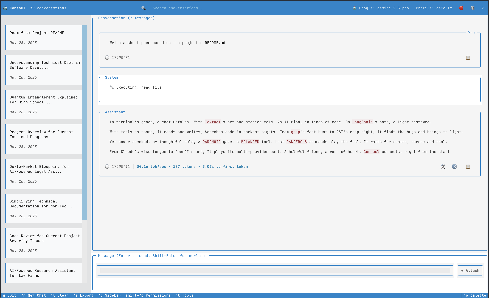

# Themes

Consoul TUI supports themes to customize the visual appearance of the interface.

## Consoul Official Themes

Consoul provides two official themes based on the brand color palette featuring **Sky Blue** (#0085CC), **Binary Slate** (#3D3D3D), and **Pure White** (#FFFFFF).

### Consoul Dark (Default)

Official Consoul dark theme for comfortable coding sessions.


**Color Palette:**

- **Primary**: Sky Blue (#0085CC) - Innovation and trust
- **Secondary**: Deep Purple (#44385E) - Assistant messages
- **Surface**: Binary Slate (#3D3D3D) - Panels and cards
- **Background**: Dark Gray (#2A2A2A) - Base background
- **Text**: Pure White (#FFFFFF) - Main text
- **Muted**: Light Gray (#9BA3AB) - Secondary text

**Best For:**

- Low-light environments
- Reduced eye strain
- Professional coding sessions
- Extended use
- Night work

**Features:**

- Carefully calibrated contrast ratios
- Easy on the eyes for long sessions
- Professional appearance
- Brand-consistent design

### Consoul Light

Official Consoul light theme for bright environments.



**Color Palette:**

- **Primary**: Sky Blue (#0085CC) - Innovation and trust
- **Secondary**: Binary Slate (#3D3D3D) - Professional foundation
- **Surface**: Very Light Gray (#F8F9FA) - Panels and cards
- **Background**: Pure White (#FFFFFF) - Base background
- **Text**: Binary Slate (#3D3D3D) - Main text
- **Muted**: Gray (#6C757D) - Secondary text

**Best For:**

- Bright environments
- Daytime use
- High-contrast displays
- Print-friendly screenshots
- Well-lit offices

**Features:**

- Maximum readability in bright light
- Clean, professional appearance
- WCAG AA compliant contrast
- Brand-consistent design

## Textual Built-in Themes

In addition to the two Consoul custom themes, the TUI also provides access to Textual's built-in themes through the Settings modal.

**Available Built-in Themes:**

- **monokai** - Popular dark theme with vibrant colors
- **dracula** - Dark theme with purple and pink accents
- **nord** - Arctic, north-bluish color palette
- **gruvbox** - Retro groove color scheme with warm tones
- **tokyo-night** - Clean, elegant dark theme
- **catppuccin-mocha** - Soothing pastel dark theme
- **catppuccin-latte** - Soothing pastel light theme
- **solarized-light** - Precision colors for readability
- **flexoki** - Organic, inky color scheme
- **textual-dark** - Textual's default dark theme
- **textual-light** - Textual's default light theme
- **textual-ansi** - ANSI color theme

These themes are provided by the Textual framework and may not follow Consoul's brand guidelines, but they offer variety for personal preference.

## Switching Themes

### Via Settings Modal

1. Press `^comma` (Ctrl+,) to open settings
2. Navigate to **Appearance** tab
3. Click **Theme** dropdown
4. Select desired theme
5. Click **Apply**


### Via Configuration File

Edit `~/.config/consoul/config.yaml`:

```yaml
tui:
  theme: consoul-dark  # or consoul-light, nord, gruvbox, etc.
```

Restart Consoul to apply changes.

### Via Command Line

```bash
# Launch with specific theme (future feature)
consoul tui --theme consoul-light
```

## Theme Comparison

| Theme | Type | Background | Creator | Best Use Case |
|-------|------|------------|---------|---------------|
| **Consoul Dark** | Dark | Dark Gray | Consoul | Default, professional work |
| **Consoul Light** | Light | White | Consoul | Bright environments |
| Monokai | Dark | Dark Brown | Textual | Vibrant coding |
| Dracula | Dark | Dark Purple | Textual | Modern aesthetic |
| Nord | Dark | Blue-Gray | Textual | Calm, focused work |
| Gruvbox | Dark | Brown | Textual | Warm, retro feel |
| Tokyo Night | Dark | Deep Blue | Textual | Modern, sleek |
| Catppuccin Mocha | Dark | Warm Dark | Textual | Pastel lovers |
| Catppuccin Latte | Light | Warm Light | Textual | Soft, gentle |
| Solarized Light | Light | Beige | Textual | High precision |
| Flexoki | Dark | Dark Brown | Textual | Organic feel |

## Color Accessibility

Both Consoul official themes follow accessibility guidelines:

### Contrast Ratios

All themes meet WCAG AA standards:
- Normal text: 4.5:1 minimum ✅
- Large text: 3:1 minimum ✅
- UI components: 3:1 minimum ✅

### Color Blindness Support

Themes are tested for color blindness:
- Deuteranopia (red-green) ✅
- Protanopia (red-green) ✅
- Tritanopia (blue-yellow) ✅

Colors are never the only indicator:
- Icons supplement colors
- Text labels on all states
- Border styles vary by state

## Performance

### Rendering Performance

Theme rendering performance considerations:

- **Dark themes**: Generally faster on OLED displays
- **Light themes**: Better on LCD displays in bright environments
- **Simple themes** (Consoul Dark/Light): Best performance
- **Complex themes**: May have slight rendering overhead

### Terminal Compatibility

All themes require:
- ✅ 24-bit color support (true color)
- ✅ Unicode support
- ✅ Modern terminal emulator

**Check Support:**
```bash
# Test 24-bit color support
echo $COLORTERM
# Should output: truecolor or 24bit

# Visual test
printf "\x1b[38;2;255;100;0mTRUECOLOR\x1b[0m\n"
```

**Recommended Terminals:**

- iTerm2 (macOS)
- Alacritty
- Windows Terminal
- Kitty
- WezTerm
- Hyper

### Fallback

On terminals without 24-bit color:
- Consoul falls back to 256-color mode
- Colors approximate theme colors
- Some gradients may be less smooth

## Theme Selection Guide

### By Environment

**Bright Office / Daytime:**

- ✅ Consoul Light
- ✅ Catppuccin Latte
- ✅ Solarized Light

**Dim/Dark Room / Night:**

- ✅ Consoul Dark (recommended)
- ✅ Nord
- ✅ Gruvbox
- ✅ Tokyo Night

**Variable Lighting:**

- ✅ Consoul Dark (adjustable via screen brightness)
- ✅ Nord (works in most conditions)

### By Task

**Professional Work:**

- ✅ Consoul Dark
- ✅ Consoul Light
- ✅ Nord

**Coding (Long Sessions):**

- ✅ Consoul Dark
- ✅ Gruvbox
- ✅ Tokyo Night

**Writing/Documentation:**

- ✅ Consoul Light
- ✅ Solarized Light

**Personal Preference / Fun:**

- ✅ Any theme you like!

## Tips & Tricks

### Matching Terminal Theme

For a consistent experience, match Consoul's theme with your terminal:

**iTerm2 (macOS):**
```
Preferences → Profiles → Colors → Color Presets
Select matching theme
```

**Alacritty:**
```yaml
# ~/.config/alacritty/alacritty.yml
# Import matching color scheme
```

### Quick Theme Testing

Try different themes to find your favorite:

1. Open Settings (`^comma`)
2. Switch theme
3. Click Apply (changes apply immediately)
4. Test it out
5. Switch again if desired

No restart needed - themes apply live!

## Troubleshooting

### Colors Look Wrong

**Problem**: Colors appear different than screenshots

**Solutions:**

1. **Check 24-bit color support**:
   ```bash
   echo $COLORTERM
   # Should show: truecolor or 24bit
   ```

2. **Update terminal**: Use latest version of your terminal emulator

3. **Try different terminal**: Some terminals have better color support

4. **Check terminal color settings**: Ensure true color is enabled in preferences

### Theme Not Applying

**Problem**: Theme selection doesn't change colors

**Solutions:**

1. Click **Apply** button in settings
2. Check config file for typos:
   ```yaml
   tui:
     theme: consoul-dark  # Correct spelling
   ```
3. Ensure theme name is lowercase with hyphens
4. Restart Consoul if changes still don't apply

### Performance Issues

**Problem**: Theme rendering is slow

**Solutions:**

1. Try simpler themes (Consoul Dark, Consoul Light)
2. Update terminal to latest version
3. Reduce terminal window size
4. Check terminal performance settings

## Future: Custom Themes

Custom theme support is planned for a future release:

```yaml
# Future: ~/.config/consoul/themes/custom.yaml
name: "My Custom Theme"
dark: true

colors:
  primary: "#FF5733"
  secondary: "#33FF57"
  background: "#1E1E1E"
  # ... more colors
```

Stay tuned for theme customization capabilities!

## Next Steps

- [Interface Guide](interface.md) - See how themes affect UI
- [Settings Modal](modals.md#settings-modal) - Learn to change themes
- [Configuration](configuration.md) - Configure theme settings
